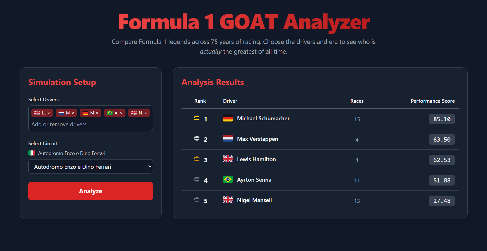

# F1 GOAT Finder
A full-stack web app that ranks Formula 1 drivers based on their historical performance at any circuit in F1 history.

## **Live Demo**
https://utsav-gowda.github.io/F1-GOAT-Finder/

**Full Tech Stack**
React, Typescript, Vite, Tailwind, Flask, MongoDB Atlas, Render, GitHub Pages.

## Inspiration and Backstory
Originally built during SteelHacks 2025, with the help of Aidan Robin. We both were watching the Azerbaijan Qualifying and decided to build this app for the hackathon. I have continued solo after the hackathon and made various improvements in my free time. See improvements sections below for the most up-to-date features.

## What it Does
Compare any set of F1 drivers at any circuit in F1's history. It pulls each driver's race results at the selected track, scores them on a 0-100 scale, and then ranks them from best to worst.

## How We Built It
**Stack:**
We used a single-page app built with React + Typescript on the frontend, Flask + MongoDB on the backend. Typescript helped catch errors early and made the codebase easy to navigate under the 24 hour time constraint.

**Components:**
The UI is structured using component-based architecture. There is a multi-select DriverSelector for choosing drivers, a FilterControls dropdown for picking circuits, and a ResultsDisplay that handles ranking, loading, and empty states.

**Styling:**
For styling, we used Tailwind CSS. This approach helped us build a visually appealing dark theme design without having to write a lot of custom CSS.

**React Hooks:**
State management is handled in the main App component using React Hooks: useState for user selections and results, useEffect for fetching initial data on visiting the page, and useCallback for memoizing the analyze handler.

**Asynchronous Operations:**
The frontend talks to a Flask API that queries MongoDB Atlas. The database was taken from Kaggle, which has historical data in the form of CSVs (results, races, drivers, circuits). When the user picks drivers and a circuit, an aggregation pipeline joins results to races, filters by circuit, and the API returns a ranked list of 0-100 performance scores.

## Challenges We Ran Into
The first hurdle was just getting the page to render at all. The second was the backend- we originally planned to pull race data from a live F1 API but ran out of time troubleshooting authentication and rate limits. We ended up pivoting to pre-loading historical race data from Kaggle into MongoDB, which gave us reliable, queryable data without depending on an external API that could potentially go down.

## Accomplishments That We're Proud Of
Shipped out a live, full-stack website within 24 hours.
Pulled an all nighter, finished in the nick of time.

## What We Learned
How to design a database schema, query MongoDB at scale, integrate a frontend and backend under deadline pressure, and how to ruin your sleep schedule.

## Improvements Since the Hackathon
After Steelhacks, I kept working on this app solo to build out the features I had wanted to add during the hackathon but didn't have time for.

**Expanded data coverage** - went from 8 hardcoded drivers and 4 circuits to the full Kaggle dataset (860 drivers, 77 circuits, 26,000+ race entries).

**Rewrote the scoring algorithm** - The hackathon version was a simple linear average. The new version:

    - Normalizes by field size so 5th in a modern 22-car grid outscores 5th in an 8-car 1950s grid.
    - Adds podium bonuses (+15 for a win, +5 for P2 or P3) because the gap between 1st and second matters a lot more than the gap between 14th and 15th.
    - Applies a sample-size confidence factor. Bayesian-style shrinkage toward a neutral score when a driver has only a few races at the circuit, so a single lucky win doesn't make somebody the GOAT of a track.

**Cross-platform flag rendering** - Windows browsers don't render flag emojis natively (they show as "GB" or "US" in letter codes), so instead I built a small 'Flag' component that converts emoji characters to Twemoji SVG images via a CDN; this works identically on every OS.

**Auto-analyze on load** - When the page opens, Hamilton, Verstappen, and Schumacher at Monaco are pre-selected and the analysis runs automatically. Anyone who visits the site can see real rankings within a second of loading, instead of seeing blank menus.

**Better UX States** - Distinct loading, empty-result, and error states. An analysis failure no longer wipes out the input form, and the empty state explains why ("None of the drivers selected have competed at this circuit") instead of showing a blank table.

**Race-count transparency** - The results table now shows how many races at the circuit each comparison is based on. A score from 21 races is meaningfully different from a score from 1 race.

**Updated Production Deployment** - I redid the deployment to GitHub Pages via a Github actions workflow; the backend is deployed to Render with auto-redeploy on push; MongoDB Atlas free tier with proper CORS, TLS, and IP allowlisting. A scheduled keep-warm pinger prevents Render's free tier from taking 30+ seconds to wake back up when activity is detected on the page.

**More Updates to follow whenever I have the time!**

## Potential New Features
- Add team/constructor information per driver-circuit pair (e.g., Hamilton: Mercedes 10x, McLaren 4x at this track) for additional context.
- Maybe incorporate qualifying performance and weather conditions as additional scoring inputs (rainy tracks tend to favor more naturally talented drivers).
- Add a head-to-head visualization (lap-by-lap or race-by-race) for two-driver comparison.